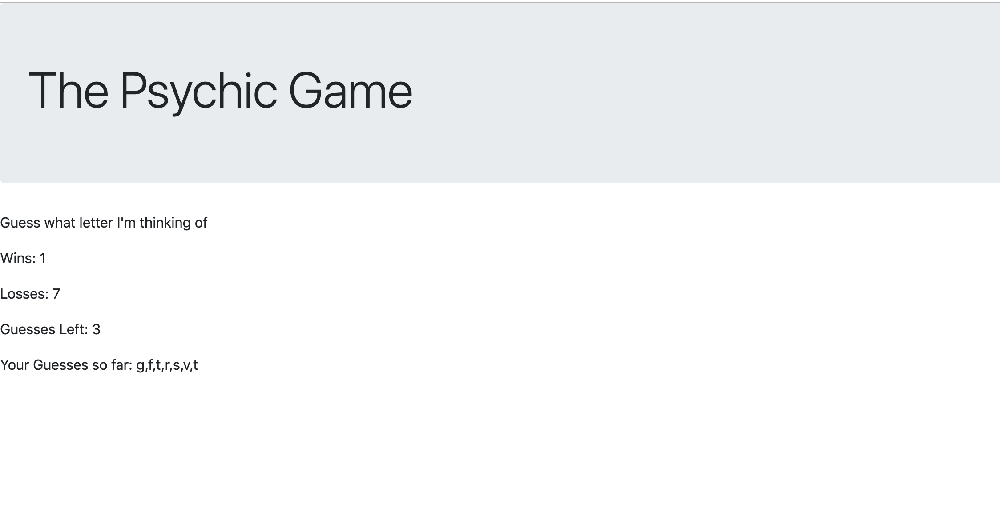

# Psychic-Game
This game was completed during the third week of Vanderbilt University's Coding Bootcamp.

## How it Works 
The user has to guess the random letter that is generated with a limited amount of guesses. 

## Screen Shot

## Technology Used
- CSS
- Javascript

### Additional Goals 
- Styling 
